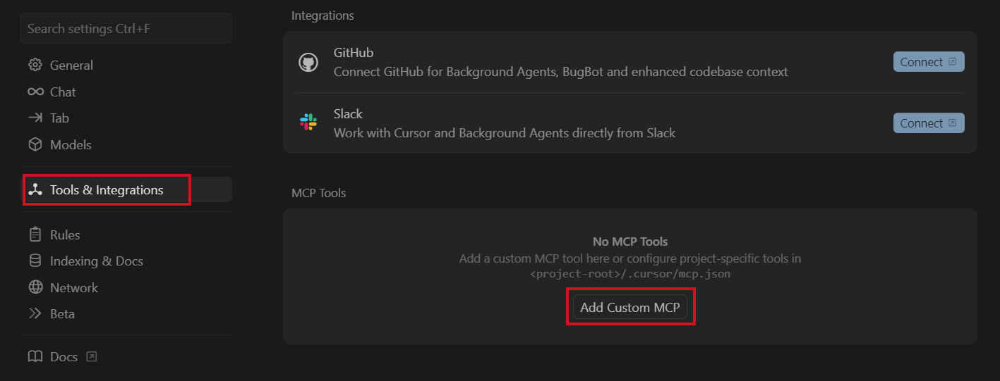
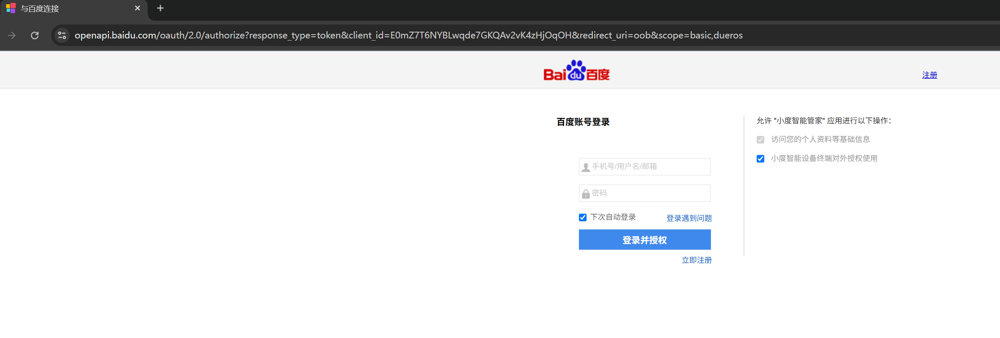
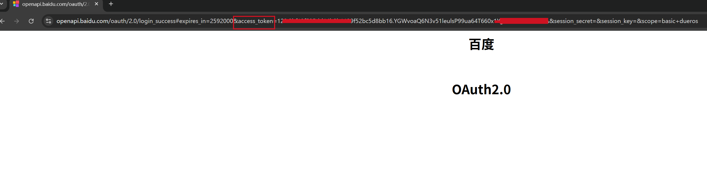
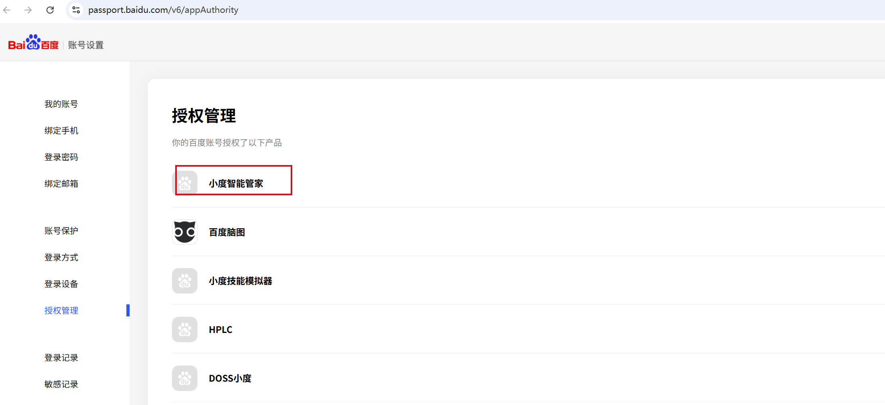
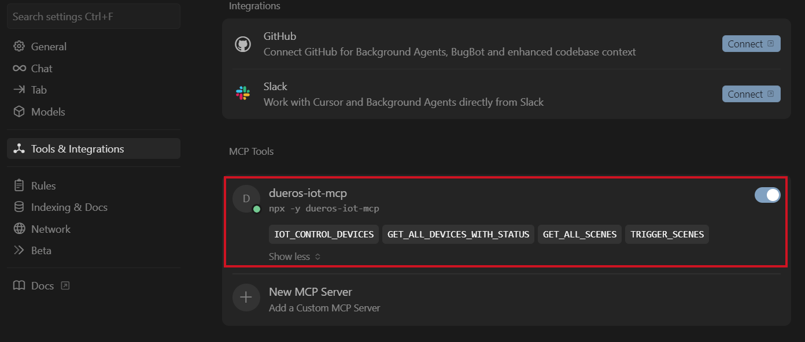

# 小度 IoT McpServer

**更新时间： 2025-07-07**

## <span id="intro">简介</span>
凡是支持MCP协议的平台（如Claude、Cursor、Cline）均能够快速接入小度IoT设备控制服务。目前仅支持 **Stdio** 方式接入。

## <span id="stdio">通过Stdio接入</span>


### <span id="config">一、配置</span>

stdio是当前各大llm应用(Claude、Cursor、Gemini Cli等)普遍支持的模式，均可参考如下配置接入，我们以Cursor为例

1.  下载最新版本Cursor，打开Cursor配置，在MCP中添加MCP Server



2.  在 `mcp.json` 配置文件中添加如下内容后保存

    ```json
    {
      "mcpServers": {
        "dueros-iot-mcp": {
          "command": "npx",
          "args": [
            "-y",
            "dueros-iot-mcp"
          ],
          "env": {
            "ACCESS_TOKEN": "你的ACEESS_TOKEN" 
          }
        }
      }
    }
    ```
    > **注意**：请确保已根据 **使用准备** 文档完成了必要的认证配置

    > *ACCESS_TOKEN的获取方式请参考[接入授权](https://dueros.baidu.com/didp/doc/dueros-bot-platform/mcp-server/prepare/prepare_markdown)*
    
    > 对于个人普通用户体验，可以通过下方的[个人用户临时授权]临时获取ACCESS_TOKEN 

3. 个人用户临时授权

第一步：账号授权

[发起授权请求](https://openapi.baidu.com/oauth/2.0/authorize?response_type=token&client_id=E0mZ7T6NYBLwqde7GKQAv2vK4zHjOqOH&redirect_uri=oob&scope=basic,dueros)



第二步：复制链接中Access Token



*授权管理*

如您需要进行应用解绑，可在 [授权管理](https://passport.baidu.com/v6/appAuthority)管理小度IoT MCP Server的授权，对授权过的应用做权限“设置”、“解除关联”等操作。



4.  回到配置，可在MCP Servers列表中查看小度IoT MCP Server启用状态



### <span id="use">二、使用</span>

在Cursor会话中选择 **Agent** 交互模式即可开始使用。
